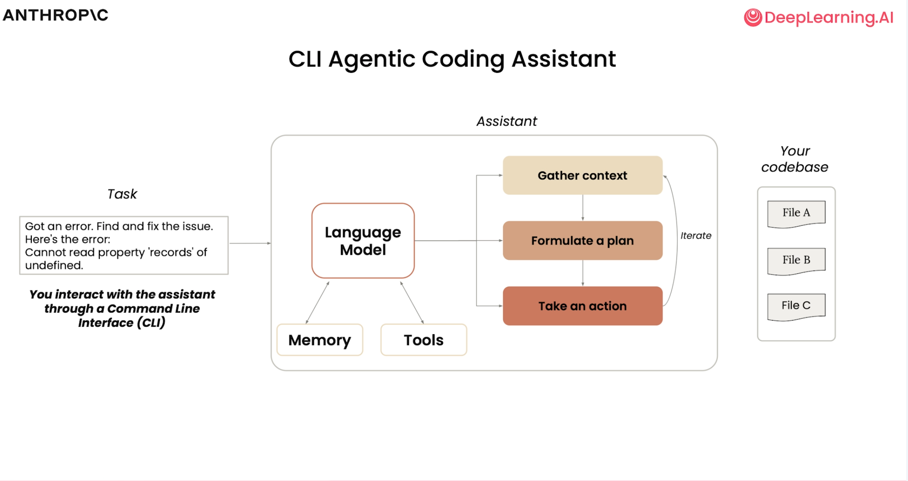

# Claude Code: A Highly Agentic Coding Assitant

> Course Notes of the [DeepLearning.AI Course: Claude Code a Highly Agentic Coding Assistant](https://learn.deeplearning.ai/courses/claude-code-a-highly-agentic-coding-assistant/lesson/66b35/introduction)
> [Github Repo for the Course](https://github.com/https-deeplearning-ai/sc-claude-code-files/blob/main/reading_notes/L0_notes.md)

- [Claude Code: A Highly Agentic Coding Assitant](#claude-code-a-highly-agentic-coding-assitant)
  - [Course Introduction](#course-introduction)
  - [What is Claude Code](#what-is-claude-code)
  - [Set-up and Codebase Understanding](#set-up-and-codebase-understanding)
  - [Adding Features](#adding-features)
    - [Frontend Feature: Clickable Source Links](#frontend-feature-clickable-source-links)
    - [Frontend Feature: “New Chat” Button](#frontend-feature-new-chat-button)
    - [Advanced Frontend: Automated Visual Testing with MCP Playwright](#advanced-frontend-automated-visual-testing-with-mcp-playwright)
    - [Backend Feature: Enhanced Course Details Tool](#backend-feature-enhanced-course-details-tool)
  - [Testing, Error Debugging and Code Refactoring](#testing-error-debugging-and-code-refactoring)
    - [Test-Driven-Development](#test-driven-development)
    - [Testing and Debugging Workflow](#testing-and-debugging-workflow)
    - [Example: Refactoring for Multi-Tool Use](#example-refactoring-for-multi-tool-use)
  - [Adding Multiple Features Simultaneously](#adding-multiple-features-simultaneously)
    - [Custom Commands in Claude Code](#custom-commands-in-claude-code)
    - [Parallel Development with **Git Worktrees**](#parallel-development-with-git-worktrees)
  - [Exploring Github Integration and Hooks](#exploring-github-integration-and-hooks)
    - [GitHub Integration](#github-integration)
    - [Hooks in Claude Code](#hooks-in-claude-code)
  - [Refactoring Jupyter Notebook and Create a Dashboard](#refactoring-jupyter-notebook-and-create-a-dashboard)
    - [Refactoring the Jupyter Notebook](#refactoring-the-jupyter-notebook)
    - [Converting to a Streamlit Dashboard](#converting-to-a-streamlit-dashboard)
  - [Creating a Web App based on a Figma Mockup](#creating-a-web-app-based-on-a-figma-mockup)
    - [Setup and Tools](#setup-and-tools)
    - [Process Overview](#process-overview)

## Course Introduction

- Key best practices and tips:
  - **Always provide clear context**: point Claude Code to relevant files and describe desired features and functionality.
  - Extend Claude Code’s capabilities by integrating with **MCP servers and other tools** in the ecosystem.
  - Use Claude Code’s features for **planning, thinking modes, parallel sessions, and memory management.**
- The course applies these practices through three hands-on examples:
  - Building a RAG chatbot, covering everything from frontend to backend, including refactoring, testing, and GitHub integration.
  - Working with Jupyter notebooks to analyze e-commerce data, refactor code, and create dashboards.
  - Creating a visual mockup in Figma, then using Claude Code and MCP servers to import, iterate, test, and build a frontend application.
- Claude Code’s architecture is intentionally simple:
  - It uses a **small set of tools** for searching, listing, and reading files (e.g., regex, directory listing).
  - It does not require semantic embedding or indexing of the codebase, keeping your code local and secure.
  - The agent autonomously reads code, takes notes in a file (code.md), and drives decision-making for code advancement.

## What is Claude Code

- Claude Code is an agentic coding assistant that leverages AI models with tool use and memory.
  - 
  - It uses a lightweight harness and command-line interface to interact with your codebase.
  - The model is enhanced with tools for reading, editing, searching files, and running shell commands.
- Tool use allows Claude Code to perform complex tasks beyond simple code generation.
  - Examples: reading files, editing code, finding patterns, searching the web, running sub-agents.
  - 
  - 
  - 
  - Key workflow:
    - 
    - Model receives a task, formulates a plan, uses tools to gather context, and takes action.
    - Example: “Make a cool visualization” triggers a to-do list, code edits, and visualization creation.
- Extensible via MCP servers (Model Context Protocol) for added functionality.
- Claude Code does not index your entire codebase, instead using agentic search to find needed information.
  - This approach improves security and keeps your code local.
  - 
- Memory is managed via a local markdown file (claude.md) that stores user preferences and session context.
  - 
  - Conversations and context are stored locally and can be reset or resumed.
  - Supports integration with environments like VS Code and GitHub.
    - Enables visualization, refactoring, debugging, and data analysis tasks.
    - Changes are visible in the editor and can be accepted or automated.
- Claude Code is seamless to set up and use, making it easy to get started and expand functionality as needed.

## Set-up and Codebase Understanding

Claude Code can agentically search the codebase, identify key files, and provide high-level overviews and detailed explanations.

- Users can ask for outlines, architecture, and specific process flows (e.g., how a user query is handled from frontend to backend).
- Claude Code excels at explaining code, making it valuable for onboarding to unfamiliar projects or technologies.
- Visualizations and diagrams can be generated by Claude Code to illustrate complex flows, enhancing understanding.
- The tool can answer practical questions like “How do I run this application?” by surfacing API docs, web interfaces, and required environment variables.

Sample Questions

```text
- Give me an overview of this codebase
- What are the key data models?
- Explain how the documents are processed
- What is the format of the document expected by the document_processor?
- How are the course chunks loaded to the database?
- Trace the process of handling user's query from frontend to backend
- Draw a diagram that illustrates this flow
- Explain how the text is transformed into chunks? What is the size of each chunk?
- Describe the api endpoints
- How can I run the application?
```

Key features and best practices:

1. Use the `/init` command to generate a CLAUDE.md file, which documents the codebase and introduces memory for Claude Code.
   - The file stores project overviews, key technologies, architecture diagrams, and custom instructions.
   - CLAUDE.md can be project-wide, local (developer-specific), or global (user-wide), supporting both team and personal workflows. 
      - 
2. Use `/ide` to connect Claude Code with IDEs for context-aware assistance.
3. Manging the Context of Claude Code as you go
   | Command   | Description                                      |
   |-----------|--------------------------------------------------|
   | /clear    | Clears current conversation history              |
   | /compact  | Summarizes current conversation history          |
   | ESC       | Interrupt Claude to redirect or correct it       |
   | ESC ESC   | Rewind the conversation to an earlier point in time |

4. Add custom memory or instructions directly to CLAUDE.md using shortcuts
     - #: Use # to quickly add a memory.
5. Built-in commands like `/help`, `/clear`, `/compact`, and the escape key streamline workflow, context management, and troubleshooting.
6. Claude Code integrates with Git, allowing it to add, commit, and generate descriptive commit messages for code changes.

## Adding Features

> demonstrates how to use Claude Code to add new features to a chatbot application, focusing on both frontend and backend enhancements.

Key Tips

- The importance of providing context and using plan mode for complex changes.
  - 
- The value of visual feedback and automated testing. (with Playwright MCP)
- How Claude Code can streamline both frontend and backend development, making feature addition and UI refinement fast and collaborative.

Examples
  
### Frontend Feature: Clickable Source Links

- Goal: Make referenced sources in course outlines clickable, linking to the source of truth.
- Approach:
  - Reference the correct files for modification using Claude Code’s file tagging.
  - **Use“plan mode” (Shift + Tab)** to have Claude Code generate a detailed plan before making changes.
    - 
  - Approve the plan, then let Claude Code implement changes across multiple files.
  - Test the new feature: clickable links now appear, but the default blue color is hard to read.
  - Use Claude Code’s visual capabilities: take a screenshot, paste it into Claude, and ask for a more visually appealing design.
    - take a screenshot	cmd+ shift+ ctrl + 4 (Mac) or Win + Shift + S (Windows)
    - paste a screenshot	Ctrl + V (might not work on Windows)
  - Claude Code analyzes the screenshot and updates the link styling for better readability.

Prompts

```txt
# plan mode
The chat interface displays query responses with source citations. I need to modify it so each source becomes a clickable link that opens the corresponding lesson video in a new tab:
- When courses are processed into chunks in @backend/document_processor.py, the link of each lesson is stored in the course_catalog collection
- Modify _format_results in @backend/search_tools.py so that the lesson links are  also returned
- The links should be embedded invisibly (no visible URL text)

# paste image
[Ctrl + V to paste the screenshot] these links are hard to read. Make them more visually appealing.
```

### Frontend Feature: “New Chat” Button

- Goal: Add a button to start a new chat without refreshing the page.
- Approach:
  - Clear conversation history for a fresh context.
  - Use plan mode to outline the steps for adding the button.
  - Implement the button, which clears the chat window and starts a new session.
  - Test the button to ensure it works as expected.

```txt
Add a '+ NEW CHAT' button to the left sidebar above the courses section. When clicked, it should:
- Clear the current conversation in the chat window
- Start a new session without page reload
- Handle proper cleanup on both @frontend and @backend
- Match the styling of existing sections (Courses, Try asking) - same font size, color, and uppercase formatting
```

### Advanced Frontend: Automated Visual Testing with MCP Playwright

- Integrate the Playwright MCP server to automate browser actions, screenshots, and visual checks.
- Claude Code uses Playwright to open the app, take screenshots, and verify UI changes programmatically.
- Iteratively refine the UI (e.g., remove duplicate icons, adjust alignment) based on visual feedback.

```bash
claude mcp add playwright npx @playwright/mcp@latest
# use /mcp in claude code to verify it is installed
```

```text
Using the playwright MCP server, visit 127.0.0.1:8000 and view the '+ New Chat' button. I want that button to look the same as the other links below for Courses and Try Asking. Make sure this is left aligned and that the border is removed.
```

### Backend Feature: Enhanced Course Details Tool

- Goal: Add a backend tool to provide detailed lesson information (number, title, description) for each course.
- Approach:
  - Start a new conversation for backend work.
  - Use plan mode to outline changes to the ⁠search_tools.py⁠ file.
  - Implement a new tool for lesson details, update the system prompt, and register the tool in the RAG system.
  - Test the new backend feature to ensure detailed lesson info is returned.

```text
In @backend/search_tools.py, add a second tool alongside the existing content-related tool. This new tool should handle course outline queries.
- Functionality:
   - Input: Course title
   - Output: Course title, course link, and complete lesson list
   - For each lesson: lesson number, lesson title
- Data source: Course metadata collection of the vector store
- Update the system prompt in @backend/ai_generator so that the course title, course link, the number and title of each lesson are all returned to address an outline-related queries.
- Make sure that the new tool is registered in the system. 
```

## Testing, Error Debugging and Code Refactoring

> The lesson demonstrates how to use Claude Code for robust testing, debugging, and refactoring in a chatbot codebase.

### Test-Driven-Development

- Start with tests to build a robust, maintainable codebase.
- Use plan mode and detailed prompts for complex changes.
- Claude Code can brainstorm, implement, and test multiple refactor strategies, making it a powerful tool for debugging and evolving codebases.

### Testing and Debugging Workflow


1. Identify relevant files (e.g., AI generator, RAG system, search tools).
2. Prompt Claude Code to write tests for these files using pytest and mocks.
3. Run the tests to pinpoint the source of the error.
4. Claude Code discovers a configuration issue (e.g., ⁠MAX_RESULTS⁠ set to zero), fixes it, and verifies the fix with tests.
5. The process results in a more reliable codebase with a foundation for future testing.
6. Tips
   - For complex tasks (e.g., complex architectural changes, debugging complicated issues), you can use the word "think" to trigger [extended thinking mode.](https://docs.anthropic.com/en/docs/claude-code/common-workflows#use-extended-thinking) There are several levels of thinking: **"think" < "think hard" < "think harder" < "ultrathink."** Each level allocates more thinking budget for Claude.
   - Use of subagents
     - Claude Code includes a Task tool for launching subagents to tackle complex or multi-step tasks. You can ask Claude Code to use subagents for brainstorming or to explore different aspects of a problem. These built-in subagents are general-purpose.
     - It's also possible to create custom subagents with their own context, system prompt, and tools. For details on custom subagents, see the [documentation](https://docs.anthropic.com/en/docs/claude-code/sub-agents)

### Example: Refactoring for Multi-Tool Use

1. Create a markdown file with a detailed prompt describing the current and desired behavior, requirements, and example flows.
2. Ask Claude Code to **brainstorm multiple refactor options using parallel subagents.**
3. Review and select the preferred approach (e.g., iterative vs. comprehensive).
4. Use **plan mode to approve a detailed plan** before implementation.
5. Implement the refactor, update method signatures, system prompts, and add new tests for sequential tool calls.
6. Run tests to ensure everything works and verify in the browser with complex queries.

Prompts

```markdown
Refactor @backend/ai_generator.py to support sequential tool calling where Claude can make up to 2 tool calls in separate API rounds.

Current behavior:
- Claude makes 1 tool call → tools are removed from API params → final response
- If Claude wants another tool call after seeing results, it can't (gets empty response)

Desired behavior:
- Each tool call should be a separate API request where Claude can reason about previous results
- Support for complex queries requiring multiple searches for comparisons, multi-part questions, or when information from different courses/lessons is needed

Example flow:
1. User: "Search for a course that discusses the same topic as lesson 4 of course X"
2. Claude: get course outline for course X → gets title of lesson 4
3. Claude: uses the title to search for a course that discusses the same topic → returns course information
4. Claude: provides complete answer

Requirements:
- Maximum 2 sequential rounds per user query
- Terminate when: (a) 2 rounds completed, (b) Claude's response has no tool_use blocks, or (c) tool call fails
- Preserve conversation context between rounds
- Handle tool execution errors gracefully

Notes: 
- Update the system prompt in @backend/ai_generator.py 
- Update the test @backend/tests/test_ai_generator.py
- Write tests that verify the external behavior (API calls made, tools executed, results returned) rather than internal state details. 

Use two parallel subagents to brainstorm possible plans. Do not implement any code.
```

## Adding Multiple Features Simultaneously

> demonstrates how to use Claude Code and Git worktrees to develop multiple features in parallel without overwriting or causing merge conflicts.

### Custom Commands in Claude Code

- You can create custom slash commands by adding markdown files in the ⁠.claude/commands⁠ folder.
- Example: An ⁠implement-feature⁠ command that takes arguments and writes changes to a specific file.
- Custom commands are not automatically included in every session’s context, unlike ⁠CLAUDE.md⁠.

Example: implement-featrues.md

```markdown
You will be implementing a new feature in this codebase

$ARGUMENTS

IMPORTANT: Only do this for front-end features.
Once this feature is built, make sure to write the changes you made to file called frontend-changes.md
Do not ask for permissions to modify this file, assume you can always do it.
```

### Parallel Development with **Git Worktrees**

- Git worktrees allow you to create isolated copies of your codebase for parallel feature development.
- Each worktree is opened in its own terminal, and Claude Code is run in each environment.

Simultaneous Feature Implementation

- In each worktree, a different feature is developed:
  - UI: Add a dark/light theme toggle button.
  - Testing: Enhance the testing framework and add more tests for FastAPI endpoints.
  - Quality: Add code quality tools and scripts.
- Changes are made and committed in each worktree with descriptive messages.
- Merging and Conflict Resolution
- After development, all worktrees are merged back into the main branch.
- Claude Code helps **resolve any merge conflicts** (e.g., in ⁠pyproject.toml⁠).
- Tests are run to ensure everything works after merging.

UI Feature Prompts

```markdown
# ui feature
Add a toggle button that allows users to switch between dark and light themes.

1. Toggle Button Design
    - Create a toggle button that fits the existing design aesthetic
    - Position it in the top-right
    - Use an icon-based design (sun/moon icons or similar)
    - Smooth transition animation when toggling
    - Button should be accessible and keyboard-navigable

2. Light Theme CSS Variables
    Add a light theme variant with appropriate colors:
    - Light background colors
    - Dark text for good contrast
    - Adjusted primary and secondary colors
    - Proper border and surface colors
    - Maintain good accessibility standards

3. JavaScript Functionality
    - Toggle between themes on button click
    - Smooth transitions between themes

4. Implementation Details
    - Use CSS custom properties (CSS variables) for theme switching
    - Add a `data-theme` attribute to the body or html element
    - Ensure all existing elements work well in both themes
    - Maintain the current visual hierarchy and design language

# testing feature
Enhance the existing testing framework for the RAG system in @backend/tests. The current tests cover unit components but are missing essential API testing infrastructure:

- API endpoint tests - Test the FastAPI endpoints (/api/query, /api/courses, /) for proper request/response handling
- pytest configuration - Add pytest.ini_options in pyproject.toml for cleaner test execution
- Test fixtures - Create conftest.py with shared fixtures for mocking and test data setup

The FastAPI app in backend/app.py mounts static files that don't exist in the test environment. Either create a separate test app or define the API endpoints inline in the test file to avoid import issues.

# quality feature
Add essential code quality tools to the development workflow. Set up black for automatic code formatting. Add proper formatting consistency throughout the codebase and create development scripts for running quality checks.
```

## Exploring Github Integration and Hooks

### GitHub Integration

- The `⁠/install-GitHub-app`⁠ command installs the Claude Code GitHub app for your repository.
  - [Documentation](https://docs.anthropic.com/en/docs/claude-code/github-actions)
- The integration enables Claude Code to:
  - Review pull requests automatically.
  - Respond to issues and feedback.
  - Fix errors and modify code directly from GitHub.
- You can **configure workflows for tagging Claude in issues and for automatic code reviews.**
- Claude Code creates YAML files for these workflows, which can be customized and are tracked by git.
- Once set up, Claude Code reviews pull requests, checks code quality, and identifies security issues, acting as an automated teammate.

Using Claude Code for Issue Resolution

- Issues can be created in GitHub or Claude Code.
- Tagging Claude in an issue prompts it to analyze, plan, and fix the problem, then generate a pull request with the fix.
- Claude Code can review its own code changes, providing an extra layer of quality assurance.

### Hooks in Claude Code


- Hooks (`\hooks` command) allow you to run custom code before or after specific events in Claude Code (e.g., after a tool is used).
  - Example: A PostToolUse hook that runs a terminal command (like ⁠say 'All done!'⁠) after using the Read or Grep tool.
- Hooks are defined in the ⁠`.claude/settings.local.json`⁠ file and can be customized for various events.
- Hooks can automate tasks like
  - running tests
  - linters
  - blocking certain tool usage.

Reference

- "Hooks" in Anthropic's [Claude Code In action](https://anthropic.skilljar.com/claude-code-in-action/312000).
- Documentation: [Hooks guide](https://docs.anthropic.com/en/docs/claude-code/hooks-guide) and [hooks reference](https://docs.anthropic.com/en/docs/claude-code/hooks).

## Refactoring Jupyter Notebook and Create a Dashboard

> demonstrates how to use Claude Code to refactor a messy Jupyter notebook and turn it into a clean, modular, and visually appealing dashboard.

### Refactoring the Jupyter Notebook

- Claude Code is prompted to:
  - Separate business logic from presentation by creating helper Python files for data loading and metric calculations.
  - Improve code quality, documentation, and visualizations.
  - Add configuration options for year and month filtering.
  - Generate a requirements.txt and a README for reproducibility.
- Debugging with Claude Code
  - When a KeyError appears in the refactored notebook, Claude Code is used to quickly diagnose and fix the issue.
  - The notebook is rerun, and the error is resolved, resulting in correct business metrics and improved data displays.


```markdown
The @EDA.ipynb contains exploratory data analysis on e-commerce data in @ecommerce_data, focusing on sales metrics for 2023. Keep the same analysis and graphs, and improve the structure and documentation of the notebook.

Review the existing notebook and identify:
- What business metrics are currently calculated
- What visualizations are created
- What data transformations are performed
- Any code quality issues or inefficiencies
  
**Refactoring Requirements**

1. Notebook Structure & Documentation
    - Add proper documentation and markdown cells with clear header and a brief explanation for the section
    - Organize into logical sections:
        - Introduction & Business Objectives
        - Data Loading & Configuration
        - Data Preparation & Transformation
        - Business Metrics Calculation (revenue, product, geographic, customer experience analysis)
        - Summary of observations
    - Add table of contents at the beginning
    - Include data dictionary explaining key columns and business terms
   
2. Code Quality Improvements
   - Create reusable functions with docstrings
   - Implement consistent naming and formatting
   - Create separate Python files:
 	- business_metrics.py containing business metric calculations only
	- data_loader.py loading, processing and cleaning the data  
        
3. Enhanced Visualizations
    - Improve all plots with:
        - Clear and descriptive titles 
        - Proper axis labels with units
        - Legends where needed
        - Appropriate chart types for the data
        - Include date range in plot titles or captions
        - use consistent color business-oriented color schemes
          
4. Configurable Analysis Framework
The notebook shows the computation of metrics for a specific date range (entire year of 2023 compared to 2022). Refactor the code so that the data is first filtered according to configurable month and year & implement general-purpose metric calculations. 
       

**Deliverables Expected**
- Refactored Jupyter notebook (EDA_Refactored.ipynb) with all improvements
- Business metrics module (business_metrics.py) with documented functions
- Requirements file (requirements.txt) listing all dependencies
- README section explaining how to use the refactored analysis

**Success Criteria**
- Easy-to read code & notebook (do not use icons in the printing statements or markdown cells)
- Configurable analysis that works for any date range
- Reusable code that can be applied to future datasets
- Maintainable structure that other analysts can easily understand and extend
- Maintain all existing analyses while improving the quality, structure, and usability of the notebook.
- Do not assume any business thresholds.


```

### Converting to a Streamlit Dashboard

- Claude Code is prompted to:
  - Convert the notebook into a professional dashboard with a specific layout (header, KPIs, charts, filters).
  - Use Streamlit and Plotly for interactive, styled visualizations.
  - Update the requirements and README files.
- After running the Streamlit app, the dashboard is reviewed and further refined (e.g., setting default year, adding month filters, removing empty cards).

```markdown
Convert `@EDA_Refactored.ipynb` into a professional Streamlit dashboard with this exact layout:

## Layout Structure
- **Header**: Title + date range filter (applies globally)
    - Title: left
    - Date range filter: right
- **KPI Row**: 4 cards (Total Revenue, Monthly Growth, Average order Value, Total Orders)
    - Trend indicators for Total Revenue, Average Order Value and Total Orders
    - Use red for negative trends and green for positive trend
- **Charts Grid**: 2x2 layout
  - Revenue trend line chart:
      - solid line for the current period
      - dashed line for the previous period
      - Add grid lines for easier reading
      - Y-axis formatting - show values as $300K instead of $300,000
  - Top 10 categories bar chart sorted descending:
      - Use blue gradient (light shade for lower values)
      - Format values as $300K and $2M  
  - Revenue by state: US choropleth map Color-coded by revenue amount
      - Use blue gradient
  - Bar chart showing satisfaction vs delivery time:
	- x-axis: Delivery time buckets (1-3 days, 4-7 days, etc.)
	- y-axis: Average review score
- **Bottom Row**: 2 cards 
   - Average delivery time with trend indicator
   - Review Score:
   	- Large number with stars
   	- Subtitle: "Average Review Score"

## Key Requirements
- Use Plotly for all charts
- Filter update charts correctly
- Professional styling with trend arrows/colors
- Do not use icons
- Use uniform card heights for each row
- Show two decimal places for each trend indicator
- Include requirements.txt and README.md

```

## Creating a Web App based on a Figma Mockup 

> demonstrates how to use Claude Code, Figma, and MCP servers to rapidly turn a Figma design mockup into a working web application.
>  - Claude Code can automate the translation of design assets into code, reducing manual front-end work.
>  - The integration with Figma and Playwright enables a seamless design-to-code-to-test workflow.
>  - The process is iterative: you can refine the design, regenerate code, and retest as needed.
>  - This approach is especially powerful for quickly prototyping and building modern web applications from design files.

### Setup and Tools

- The workflow uses a Figma MCP server (for extracting design/code from Figma) and a Playwright MCP server (for browser automation and testing).
- The project is built with Next.js, a modern React framework.

Set-up Figma MCP 

- Needs to on Figma paid-plan
- Open the Figma design in Figma desktop app.
- In the upper-left corner, open the Figma menu.
- Under Preferences, select Enable Dev Mode MCP Server
- You should see a confirmation message at the bottom of the screen letting you know the server is enabled and running locally at http://127.0.0.1:3845/mcp (remote server running locally using http transport).

Configure the MCP Server for Claude Code

- In the terminal, type: `claude mcp add --transport http figma-dev-mode-mcp-server http://127.0.0.1:3845/mcp.`
- Also add MCP playwright server: `claude mcp add playwright npx @playwright/mcp@latest.`
L- aunch Claude Code and verify that you're connected to both MCP servers (using /mcp)

Alternative: Framelink Figma MCP server (as well as some best practices for using it)

- [Guide](https://www.framelink.ai/docs/quickstart?utm_source=github&utm_medium=referral&utm_campaign=readme)
- [Best Practices](https://www.framelink.ai/docs/best-practices)
- You can configure it for Claude Code using:`claude mcp add "Framelink Figma MCP" -- npx -y figma-developer-mcp --figma-api-key=YOUR-KEY --stdio`
- Or this command: `claude mcp add-json "Framelink-Figma-MCP" '{"command": "npx", "args": ["-y", "figma-developer-mcp", "--figma-api-key=YOUR-KEY","--stdio"]}'`
  
### Process Overview

1. Start by creating a new Next.js app and installing dependencies.
2. In Figma, enable dev mode and select the MCP server.
3. Copy the desired Figma layer (the dashboard mockup) for use in Claude Code.
4. Connect both the Figma and Playwright MCP servers to Claude Code using the ⁠/mcp⁠ command.
5. Use Claude Code to analyze the Figma mockup, generate the necessary HTML/CSS/JS, and build the web app structure.
6. Playwright is used to programmatically test the generated app, take screenshots, and verify the UI matches the mockup.

Prompts

```markdown
Using the following figma mockup (paste the link) use the figma dev MCP server to analyze the mockup and build the underlying code in this next.js application. Use the recharts library for creating charts to make this a web application. Check how this application looks using the playwright MCP server and verify it looks as close to the mock as possible.

```

```markdown
populate these charts with real-world data from FRED
```
