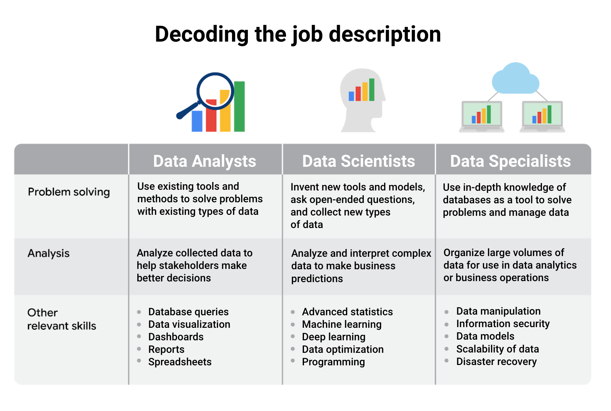

# Foundations: Data, Data Every Where

> Course 1 of [Google Data Analytics Certificate](https://www.coursera.org/professional-certificates/google-data-analytics)

- [Foundations: Data, Data Every Where](#foundations-data-data-every-where)
  - [week1 Introduction](#week1-introduction)
    - [What is Data and Data Analysis?](#what-is-data-and-data-analysis)
    - [Turning data into insights](#turning-data-into-insights)
      - [6 phases of the data analysis process (Data Anlysis Life Cycle)](#6-phases-of-the-data-analysis-process-data-anlysis-life-cycle)
      - [3 dimensions of data analytics](#3-dimensions-of-data-analytics)
      - [the difference between data scientists and data analysts.](#the-difference-between-data-scientists-and-data-analysts)
    - [the Data Ecosystem](#the-data-ecosystem)
  - [Week 2 Data Analyst's Key Skills](#week-2-data-analysts-key-skills)
    - [Key data analyst's skills](#key-data-analysts-skills)
    - [Thinking analytically](#thinking-analytically)
  - [Week 3 Data Analyst's Tools](#week-3-data-analysts-tools)
    - [Data Life Cycle](#data-life-cycle)
    - [Data Analysis Process (6 Steps)](#data-analysis-process-6-steps)
    - [Data Analyst's Tools](#data-analysts-tools)
      - [Spreadsheets](#spreadsheets)
      - [Databases and query languages](#databases-and-query-languages)
      - [Visualization tools](#visualization-tools)
  - [Week 4 Spread Sheets, SQL, Visualization Learning Resources](#week-4-spread-sheets-sql-visualization-learning-resources)
  - [Week 5 Data analyst roles and job descriptions](#week-5-data-analyst-roles-and-job-descriptions)
    - [Business Problem](#business-problem)
    - [Job Descriptions of Data Analyst](#job-descriptions-of-data-analyst)
    - [Fairness in Data](#fairness-in-data)

## week1 Introduction

### What is Data and Data Analysis?

- Data: A collection of facts
- Data analysis: The collection, transformation, and organization of data in order to draw conclusions, make predictions, and drive informed decision-making
- Data analyst: Someone who collects, transforms, and organizes data in order to drive **informed decision-making**
  - A data analyst is an explorer, a detective, and an artist all rolled into one. Analytics is the quest for inspiration.
  - the difference between data scientists and data analysts. It's easy to confuse the two, but what they do is actually very different. Data science is defined as creating new ways of modeling and understanding the unknown by using raw data. Here's a good way to think about it. Data scientists create new questions using data, while analysts find answers to existing questions by creating insights from data sources.
- Data analytics: The science of data
- **Data-driven decision-making**: Using facts to guide business strategy
  - At the heart of data-driven decision making is data. Therefore, it's essential that data analysts focus on the data to ensure they make informed decisions. If you ignore data by preferring to make decisions based on your own experience, your decisions may be biased. But even worse, decisions based on gut instinct without any data to back them up can cause mistakes.
- Data ecosystem: The various elements that interact with one another in order to produce, manage, store, organize, analyze, and share data
- Data science: A field of study that uses raw data to create new ways of modeling and understanding the unknown
- Dataset: A collection of data that can be manipulated or analyzed as one unit

### Turning data into insights

Data + business knowledge = mystery solved

after analysts have created insights from data, what happens?

  Well, a lot. Those insights are shared with others, decisions are made, and businesses take action. And here's where it can get really exciting. Data analytics can help organizations completely rethink something they do or point them in a totally new direction

The first step in data-driven decision-making is figuring out the business need. Usually, this is a problem that needs to be solved.

- new company needing to establish better brand recognition, so it can compete with bigger, more well-known competitors.
- an organization wants to improve a product and needs to figure out how to source parts from a more sustainable or ethically responsible supplier.
- could be a business trying to solve the problem of unhappy employees, low levels of engagement, satisfaction and retention.
  
Whatever the problem is, once it's defined, a data analyst finds data, analyzes it and uses it to uncover trends, patterns and relationships. Sometimes the data-driven strategy will build on what's worked in the past. Other times, it can guide a business to branch out in a whole new direction

- movie streaming service
- e-commerce
  
Data alone will never be as powerful as data combined with human experience, observation, and sometimes even intuition. To get the most out of data-driven decision-making, it's important to include insights from people who are familiar with the business problem.

#### 6 phases of the data analysis process (Data Anlysis Life Cycle)

1. Ask questions and define the problem.(Business Challenge/Objective/Question)
   1. What kind of results are needed?
   2. Who will be informed?
   3. Am I answering the question being asked?
   4. How quickly does a decision need to be made?
2. Prepare data by collecting and storing the information.
   1. (Data generation, collection, storage, and data management)
3. Process data by cleaning and checking the information.
   1. (Data cleaning/data integrity)
4. Analyze data to find patterns, relationships, and trends.
   1. (Data exploration, visualization, and analysis)
5. Share data with your audience.
   1. (Communicating and interpreting results)
6. Act on the data and use the analysis results.
   1. (Putting your insights to work to solve the problem)

[EMC's data analysis life cycle](https://onlinelibrary.wiley.com/doi/pdf/10.1002/9781119183686)

1. Discovery
2. Pre-processing data
3. Model planning
4. Model building
5. Communicate results
6. Operationalize

[SAS's iterative life cycle](https://www.sas.com/content/dam/SAS/en_us/doc/whitepaper1/manage-analytical-life-cycle-continuous-innovation-106179.pdf)

1. Ask
2. Prepare
3. Explore
4. Model
5. Implement
6. Act
7. Evaluate

[Project-based data analytics life cycle](http://pingax.com/understanding-data-analytics-project-life-cycle/)

1. Identifying the problem
2. Designing data requirements
3. Pre-processing data
4. Performing data analysis
5. Visualizing data

[Big data analytics life cycle](https://www.informit.com/articles/article.aspx?p=2473128&seqNum=11&ranMID=24808)

Authors Thomas Erl, Wajid Khattak, and Paul Buhler proposed a big data analytics life cycle in their book, Big Data Fundamentals: Concepts, Drivers & Techniques. Their life cycle suggests phases divided into nine steps:

1. Business case evaluation
2. Data identification
3. Data acquisition and filtering
4. Data extraction
5. Data validation and cleaning
6. Data aggregation and representation
7. Data analysis
8. Data visualization
9. Utilization of analysis results

they have just broken down what we have been referring to as Prepare and Process into smaller steps.

#### 3 dimensions of data analytics

Machine learning, statistics, and analytics.These are separated by how many decisions you know you want to make before you begin with them.

- if you want to make a few important decisions under uncertainty, that is **statistics**.
  - The excellence of statistics is rigor. Statisticians are essentially philosophers, epistemologists. They are very, very careful about protecting decision-makers from coming to the wrong conclusion.
- If you want to automate, in other words, make many, many, many decisions under uncertainty, that is machine learning and AI.
  - Performance is the excellence of the machine learning and AI engineer.
- But what if you don't know how many decisions you want to make before you begin? What if what you're looking for is inspiration? You want to encounter your unknown unknowns. You want to understand your world. That is analytics.
  - The excellence of an analyst is speed. How quickly can you surf through vast amounts of data to explore it and discover the gems, the beautiful potential insights that are worth knowing about and bringing to your decision-makers

#### the difference between data scientists and data analysts.

- Data science is defined as creating new ways of **modeling and understanding the unknown** by using raw data. Data scientists create new questions using data
- Analysts find answers to existing questions by creating insights from data sources.

### the Data Ecosystem

Data ecosystems are made up of various elements that interact with one another in order to produce, manage, store, organize, analyze, and share data. These elements include hardware and software tools, and the people who use them.

## Week 2 Data Analyst's Key Skills

### Key data analyst's skills

- Curiosity: a desire to know more about something, asking the right questions
- Understanding context: understanding where information fits into the “big picture”
  - dentifying the motivation behind the collection of a dataset
  - Gathering additional information about data to understand the broader picture
  - Adding descriptive headers to columns of data in a spreadsheet
- Having a technical mindset: breaking big things into smaller steps
- Data design: thinking about how to organize data and information
- Data strategy: thinking about & managing the people, processes, and tools used in data analysis

### Thinking analytically

1. Visualization
2. Strategy: Think in different ways
   1. what is the root cause of a problem (5 Whys)
   2. Used in scienfic reseach, writing , etc ...
3. Problem-orientation
4. Correlation(Correlation doesnt infer causation)
5. Big-picture and detail-oriented thinking

## Week 3 Data Analyst's Tools

### Data Life Cycle

1. Plan: Decide what kind of data is needed, how it will be managed, and who will be responsible for it.
2. Capture: Collect or bring in data from a variety of different sources.
3. Manage: Care for and maintain the data. This includes determining how and where it is stored and the tools used to do so.
4. Analyze: Use the data to solve problems, make decisions, and support business goals.
5. Archive: Keep relevant data stored for long-term and future reference.
6. Destroy: Remove data from storage and delete any shared copies of the data.

Variations

Financial Institutions [Data Life Cycle](https://sfmagazine.com/post-entry/july-2018-the-data-life-cycle/)

1. Capture
2. Qualify
3. Transform
4. Utilize
5. Report
6. Archive
7. Purge

[Havard Business School (HBS)](https://online.hbs.edu/blog/post/data-life-cycle)

1. Generation
2. Collection
3. Processing
4. Storage
5. Management
6. Analysis
7. Visualization
8. Interpretation

### Data Analysis Process (6 Steps)

### Data Analyst's Tools

#### Spreadsheets

Data analysts rely on spreadsheets to collect and organize data. Two popular spreadsheet applications you will probably use a lot in your future role as a data analyst are Microsoft Excel and Google Sheets.
Spreadsheets structure data in a meaningful way by letting you

- Collect, store, organize, and sort information
- Identify patterns and piece the data together in a way that works for each specific data project
- Create excellent data visualizations, like graphs and charts.

#### Databases and query languages

A database is a collection of structured data stored in a computer system. Some popular Structured Query Language (SQL) programs include MySQL, Microsoft SQL Server, and BigQuery.

Query languages

- Allow analysts to isolate specific information from a database(s)
- Make it easier for you to learn and understand the requests made to databases
- Allow analysts to select, create, add, or download data from a database for analysis

#### Visualization tools

Data analysts use a number of visualization tools, like graphs, maps, tables, charts, and more. Two popular visualization tools are **Tableau** and Looker.

These tools

- Turn complex numbers into a story that people can understand
- Help stakeholders come up with conclusions that lead to informed decisions and effective business strategies  
- Have multiple features
  - Tableau's simple drag-and-drop feature lets users create interactive graphs in dashboards and worksheets
  - Looker communicates directly with a database, allowing you to connect your data right to the visualtool you choose

A career as a data analyst also involves using programming languages, like R and Python, which are used a lot for statistical analysis, visualization, and other data analysis.

## Week 4 Spread Sheets, SQL, Visualization Learning Resources

- [Excel Video Training by Microsoft](https://support.microsoft.com/en-us/office/excel-video-training-9bc05390-e94c-46af-a5b3-d7c22f6990bb)
- [Google Sheet Cheatsheet](https://support.google.com/a/users/answer/9300022)
- [Google Sheet Training](https://support.google.com/a/users/answer/9282959?visit_id=637361702049227170-1815413770&rd=1)
- [Tableu Public](https://public.tableau.com/en-us/s/resources)
- [R Studio](https://www.rstudio.com/)
- [R Studio Cheatsheets](https://www.rstudio.com/resources/cheatsheets/)
- [R Studio Primer](https://rstudio.cloud/learn/primers/3)

## Week 5 Data analyst roles and job descriptions

### Business Problem

Business Task is the problem Data Analyst Focus to solve

1. How could it use data to improve customer experience?
2. What kinds of data would it need to collect?
3. How could insights from that data solve a problem?

Data-driven decision-making is using facts to guide business strategy

- Getting a complete picture of a problem and its causes
- Combining observation with objective data
- Using data analytics to find the best possible solution to a problem

### Job Descriptions of Data Analyst

> As technology continues to advance, being able to collect and analyze the data from that new technology has become a huge competitive advantage for a lot of businesses. Everything from websites to social media feeds are filled with fascinating data that, when analyzed and used correctly, can help inform business decisions. A company’s ability to thrive now often depends on how well it can leverage data, apply analytics, and implement new technologies.
>
> This is why skilled data analysts are some of the most sought-after professionals in the world. A study conducted by IBM estimates that there are over 380,000 job openings in the Data Analytics field in the United States*. Because the demand is so strong, you’ll be able to find job opportunities in virtually any industry. Do a quick search on any major job site and you’ll notice that every type of business from zoos, to health clinics, to banks are seeking talented data professionals. Even if the job title doesn’t use the exact term “data analyst,” the job description for most roles involving data analysis will likely include a lot of the skills and qualifications you’ll gain by the end of this program. In this reading, we’ll explore some of the data analyst-related roles you might find in different companies and industries.
>
> Burning Glass data, Feb 1, 2021 - Jan 31, 2022, US

The data analyst role is one of many job titles that contain the word “analyst.”

To name a few others that sound similar but may not be the same role:

- Business analyst — analyzes data to help businesses improve processes, products, or services
- Data analytics consultant — analyzes the systems and models for using data
- Data engineer — prepares and integrates data from different sources for analytical use
- Data scientist — uses expert skills in technology and social science to find trends through data analysis
- Data specialist — organizes or converts data for use in databases or software systems
- Operations analyst — analyzes data to assess the performance of business operations and workflows

Job specializations by industry

industry-specific specialist positions that you might come across in your data analyst job search include

- Marketing analyst — analyzes market conditions to assess the potential sales of products and services
- HR/payroll analyst — analyzes payroll data for inefficiencies and errors
- Financial analyst — analyzes financial status by collecting, monitoring, and reviewing data
- Risk analyst — analyzes financial documents, economic conditions, and client data to help companies determine the level of risk involved in making a particular business decision
- Healthcare analyst — analyzes medical data to improve the business aspect of hospitals and medical facilities

### Fairness in Data

Fairness is achieved when data analysis doesn't create or reinforce bias.

[Fairness in Machine Learning](https://en.wikipedia.org/wiki/Fairness_(machine_learning))