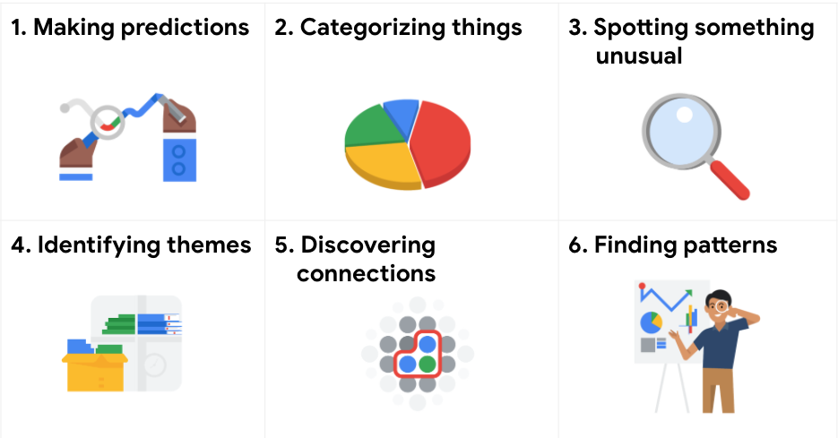
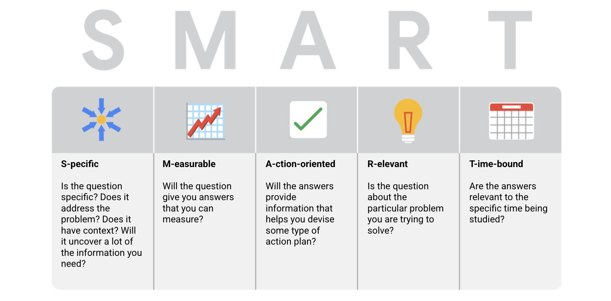
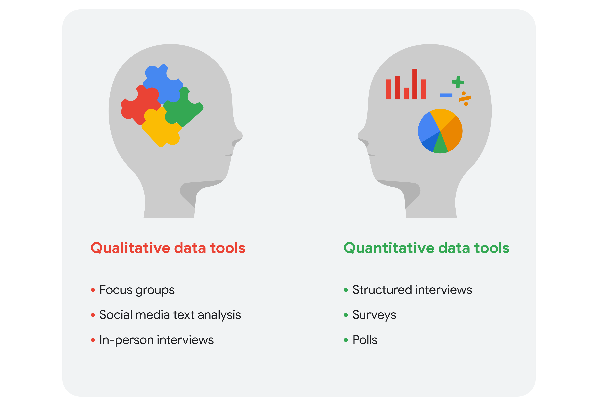

# Ask Questions to Make Data-Driven Decisions

> Course 2 of [Google Data Analytics Certificate](https://www.coursera.org/professional-certificates/google-data-analytics)

- [Ask Questions to Make Data-Driven Decisions](#ask-questions-to-make-data-driven-decisions)
  - [Week1: Ask Effective Questions](#week1-ask-effective-questions)
    - [Six Steps of Data Analysis Process](#six-steps-of-data-analysis-process)
      - [Step 1: Ask](#step-1-ask)
      - [Step 2: Prepare](#step-2-prepare)
      - [Step 3: Process](#step-3-process)
      - [Step 4: Analyze](#step-4-analyze)
      - [Step 5: Share](#step-5-share)
      - [Step 6: Act](#step-6-act)
    - [Six Problem Types (for Data Analysis)](#six-problem-types-for-data-analysis)
    - [Effective Questions](#effective-questions)
  - [Week2: Making data-driven decisions](#week2-making-data-driven-decisions)
    - [Understand the Power of Data](#understand-the-power-of-data)
      - [Qualitative Data vs Quantitative Data](#qualitative-data-vs-quantitative-data)
      - [SMART Questions about the Data Source](#smart-questions-about-the-data-source)
    - [Follow Evidence](#follow-evidence)
      - [Metrics](#metrics)
      - [Dashboards](#dashboards)
    - [Big Data](#big-data)
  - [Week 3: Speardsheets Basics](#week-3-speardsheets-basics)
    - [Google Sheet and Excel ShortCuts](#google-sheet-and-excel-shortcuts)

## Week1: Ask Effective Questions

### Six Steps of Data Analysis Process

When you are starting out in your career as a data analyst, it is normal to feel pulled in a few different directions with your role and expectations. Following processes like the ones outlined here and using structured thinking skills can help get you back on track, fill in any gaps and let you know exactly what you need.

These six steps can help you to break the data analysis process into smaller, manageable parts, which is called **structured thinking**. This process involves four basic activities:

- Recognizing the current problem or situation
- Organizing available information
- Revealing gaps and opportunities
- Identifying your options

#### Step 1: Ask

It’s impossible to solve a problem if you don’t know what it is. These are some things to consider:

- Define the problem you’re trying to solve
- Make sure you fully understand the stakeholder’s expectations
- Focus on the actual problem and avoid any distractions
- Collaborate with stakeholders and keep an open line of communication
- Take a step back and see the whole situation in context

Questions to ask yourself in this step:

- What are my stakeholders saying their problems are?
- Now that I’ve identified the issues, how can I help the stakeholders resolve their questions?

#### Step 2: Prepare

You will decide what data you need to collect in order to answer your questions and how to organize it so that it is useful. You might use your business task to decide:

- What metrics to measure
- Locate data in your database
- Create security measures to protect that data

Questions to ask yourself in this step:

- What do I need to figure out how to solve this problem?
- What research do I need to do?

#### Step 3: Process

Clean data is the best data and you will need to clean up your data to get rid of any possible errors, inaccuracies, or inconsistencies. This might mean:

- Using spreadsheet functions to find incorrectly entered data
- Using SQL functions to check for extra spaces
- Removing repeated entries
- Checking as much as possible for bias in the data

Questions to ask yourself in this step:

- What data errors or inaccuracies might get in my way of getting the best possible answer to the problem I am trying to solve?
- How can I clean my data so the information I have is more consistent?

#### Step 4: Analyze

You will want to think analytically about your data. At this stage, you might sort and format your data to make it easier to:

- Perform calculations
- Combine data from multiple sources
- Create tables with your results

Questions to ask yourself in this step:

- What story is my data telling me?
- How will my data help me solve this problem?
- Who needs my company’s product or service? What type of person is most likely to use it?

#### Step 5: Share

Everyone shares their results differently so be sure to summarize your results with clear and enticing visuals of your analysis using data via tools like graphs or dashboards. This is your chance to show the stakeholders you have solved their problem and how you got there. Sharing will certainly help your team:  

- Make better decisions
- Make more informed decisions
- Lead to stronger outcomes
- Successfully communicate your findings

Questions to ask yourself in this step:

- How can I make what I present to the stakeholders engaging and easy to understand?
- What would help me understand this if I were the listener?

#### Step 6: Act

Now it’s time to act on your data. You will take everything you have learned from your data analysis and put it to use. This could mean providing your stakeholders with recommendations based on your findings so they can make data-driven decisions.

Questions to ask yourself in this step:

- How can I use the feedback I received during the share phase (step 5) to actually meet the stakeholder’s needs and expectations?

### Six Problem Types (for Data Analysis)

- Making predictions
  - decide best audience for advertisting, choose the best channel
- Categorizing things
  - classify customer service calls based on certain keywords or scores.
- Spotting something unusual
  - set alarms, anti-fraud. etc
- Identifying themes
  - **User experience (UX)** designers might rely on analysts to analyze user interaction data. improvement projects might require analysts to identify themes to help prioritize the right product features for improvement. Themes are most often used to help researchers explore certain aspects of data. In a user study, user beliefs, practices, and needs are examples of themes.
  - categorizing things involves assigning items to categories; identifying themes takes those categories a step further by grouping them into broader themes.
- Discovering connections
  - find correlations and causalities between data
- Finding patterns
  - Minimizing downtime caused by machine failure is an example of a problem requiring analysts to find patterns in data.

### Effective Questions

The [SMART Rule](https://emkautsar.medium.com/highly-effective-questions-are-smart-questions-59040efea480)

Things to aviod when asking questions

- Leading questions: questions that only have a particular response
- Closed-ended questions: questions that ask for a one-word or brief response only
- Vague questions: questions that aren’t specific or don’t provide context.

## Week2: Making data-driven decisions

### Understand the Power of Data

- The goal of all data analysts is to use data to draw accurate conclusions and make good recommendations. That all starts with having complete, correct, and relevant data. When data is interpreted incorrectly, it can lead to huge losses. Consider the examples below.
- Data-inspired decision-making explores different data sources to find out what they have in common
- Data-driven decisions

#### Qualitative Data vs Quantitative Data

- Quantitative data is all about the specific and objective measures of numerical facts. This can often be the what, how many, and how often about a problem. 
- . On the other hand, qualitative data describes subjective or explanatory measures of qualities and characteristics or things that can't be measured with numerical data, like your hair color. Qualitative data is great for helping us answer why questions

#### SMART Questions about the Data Source

turn your attention to your notes and reflect on what you know about the data itself:

- What are the sources of data available for the project?
- Which data sources were qualitative and which were quantitative? Explain your answer. 
- What decisions could you make when considering each data source separately? Could you make different decisions about the data if you combined it? If so, give an example.
- Is there any kind of data that isn’t available, but you would like to find? If so, what is it, and why would you like to know more about it?

### Follow Evidence

#### Metrics

- A metric is a single, quantifiable type of data that can be used for Setting and evaluating goals
- Different industries use all kinds of different metrics. But there's one thing they all have in common: they're all trying to meet a specific goal by measuring data.
- This metric goal is a measurable goal set by a company and evaluated using metrics. And just like there are a lot of possible metrics, there are lots of possible goals too.
- By using metrics to focus on individual aspects of your data, you can start to see the story your data is telling. Metric goals and formulas are great ways to measure and understand data.**But they're not the only ways.**

#### Dashboards

A dashboard organizes information from multiple datasets into one central location, offering huge time-savings. Data analysts use dashboards to track, analyze, and visualize data in order to answer questions and solve problems. 

> [Tableu Examples](https://www.tableau.com/learn/articles/business-intelligence-dashboards-examples)

Benefits | For Data Analysts |For Stakeholders
---------|----------|---------
 **Centralization** | Sharing a single source of data with all stakeholders | Working with a comprehensive view of data, initiatives, objectives, projects, processes, and more
 **Visualization** | Showing and updating live, incoming data in real time | Spotting changing trends and patterns more quickly
 **Insightfulness** | Pulling relevant information from different datasets | Understanding the story behind the numbers to keep track of goals and make data-driven decisions
|**Customization**  | Creating custom views dedicated to a specific person, project, or presentation of the data | Drilling down to more specific areas of specialized interest or concern

### Big Data

Small data | Big data
---------|----------
 Describes a data set made up of specific metrics over a short, well-defined time period | Describes large, less-specific data sets that cover a long time period
 Usually organized and analyzed in spreadsheets | Usually kept in a database and queried 
 Likely to be used by small and midsize businesses | Likely to be used by large organizations
 Simple to collect, store, manage, sort, and visually represent | Takes a lot of effort to collect, store, manage, sort, and visually represent
 Usually already a manageable size for analysis | Usually needs to be broken into smaller pieces in order to be organized and analyzed effectively for decision-making

Here are some challenges you might face when working with big data:

- A lot of organizations deal with data overload and way too much unimportant or irrelevant information.
- Important data can be hidden deep down with all of the non-important data, which makes it harder to find and use. This can lead to slower and more inefficient decision-making time frames.
- The data you need isn’t always easily accessible.
- Current technology tools and solutions still struggle to provide measurable and reportable data. This can lead to unfair algorithmic bias.
- There are gaps in many big data business solutions.

Now for the good news! Here are some benefits that come with big data:

- When large amounts of data can be stored and analyzed, it can help companies identify more efficient ways of doing business and save a lot of time and money.
- Big data helps organizations spot the trends of customer buying patterns and satisfaction levels, which can help them create new products and solutions that will make customers happy.
- By analyzing big data, businesses get a much better understanding of current market conditions, which can help them stay ahead of the competition.
- As in our earlier social media example, big data helps companies keep track of their online presence—especially feedback, both good and bad, from customers. This gives them the information they need to improve and protect their brand.

4 Vs of Big Data

- Volume
  - The amount of data
- Variety
  - The different kinds of data
- Velocity
  - How fast the data can be processed
- Veracity
  - The quality and reliability of the data

## Week 3: Speardsheets Basics

### Google Sheet and Excel ShortCuts

- [Google Sheets](https://support.google.com/docs/answer/181110)
- [Excel](https://support.microsoft.com/en-us/office/keyboard-shortcuts-in-excel-1798d9d5-842a-42b8-9c99-9b7213f0040f#PickTab=macOS)